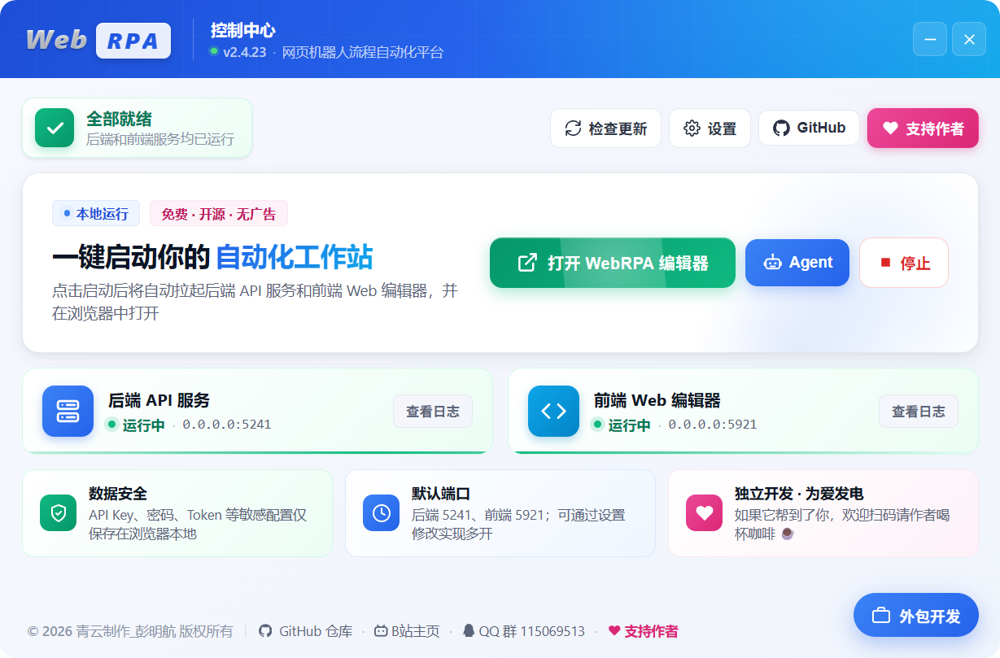

<div align="center">
    
</div>
<h1 align="center">
WebRPA - Web Robotic Process Automation Tool
</h1>
<p align="center">
  
  
  
  
  
  
  
</p>

<p align="center">
  <a href="README.md">中文</a> · <b>English</b>
</p>


**A powerful visual web automation tool (with some support for Windows desktop automation and Android automation). Build automation workflows quickly by dragging and dropping modules — no coding required — to accomplish web data scraping, form filling, automated testing and more.**

> **⚠️ Important notice: This software is provided only as a technical tool. Users must comply with all applicable laws and regulations; the developer assumes no liability for how users use it. See the [Disclaimer](#️-disclaimer).**

> **【Please download the latest 7z archive from Releases — the latest source code and runtime are all inside; extract and run. 😇】**
>
> Support WebRPA development: [Afdian page](https://ifdian.net/a/qypmh)

## ✨ Features

### 🎯 Core advantages

- **🚀 Zero-code development**: Visual drag-and-drop, no programming background required
- **📦 Ready to use**: Bundled Python and Node.js runtimes, one-click start
- **🔧 Rich modules**: 560+ functional modules covering 95% of automation scenarios (including DrissionPage-based anti-detection web automation modules)
- **🤖 AI Assistant**: A built-in AI assistant that understands intent in chat, auto-builds/troubleshoots workflows, and has **self-healing** ability (on failure it diagnoses → fixes → re-runs). OpenAI-compatible protocol, supporting OpenAI / Zhipu / DeepSeek / Ollama and more. Three **permission levels** (Per-action confirm / Smart auto / Full access), and one-click **AI Diagnosis** when the editor errors out
- **🛡️ Never goes blank**: A global error boundary catches everything — any module exception shows an error card (with details and AI Diagnosis) instead of letting the editor white-screen
- **🌳 Version history**: Git-style local snapshots (including nodes, edges and global variables) that can be restored / compared anytime; the assistant auto-saves a snapshot before big changes
- **☁️ WebDAV remote storage**: Workflows can be saved to / loaded from NAS, Nextcloud, Jianguoyun, etc., shared across devices
- **⌨️ Custom shortcuts**: Common actions (run / stop / save / new, etc.) can be freely bound to key combinations
- **🎨 Beautiful UI**: Modern UI design with lively Motion animations and smooth interactions, with Mermaid flowchart support
- **⚡ High performance**: Built on FastAPI + React for fast responses
- **🔌 Easy to extend**: Modular architecture, supports custom module development and MCP server integration
- **📚 Complete docs**: Built-in detailed tutorials covering all module categories
- **🆓 Completely free**: Free for non-commercial use, open and transparent
- **🔍 Smart search**: Modules and tutorials support fuzzy search by Chinese, Pinyin and Pinyin initials
- **📊 Visual flow**: Built-in Mermaid flowcharts intuitively show workflow logic
- **💾 Variable autocomplete**: Default variable names are added to the autocomplete list when modules are created
- **🌐 Fully offline**: All resources are local, no internet required, perfect for LAN deployment

---

## 🖼️ Screenshots



---


---


---


---


---


---


---


------

## 🚀 Quick start

### Requirements

- Windows 10/11 (this project supports Windows only)
- Bundled Python 3.13 and Node.js (no extra installation needed)

### How to start

Download the latest 7z archive from Releases, extract it, and launch the project with `WebRPA启动器.exe` (WebRPA Launcher):

1. Double-click `WebRPA启动器.exe`
2. Configure the backend and frontend ports in the launcher
3. Click the "Start WebRPA" button to start the services
4. The launcher automatically opens your browser to the frontend UI

Default URLs:
- Backend: http://localhost:5241 (default port, configurable in the launcher)
- Frontend: http://localhost:5921 (default port, configurable in the launcher)

### Configuration file

The `WebRPAConfig.json` file in the project root lets you customize service ports and host addresses:

```json
{
  "backend": {
    "host": "0.0.0.0",
    "port": 5241,
    "reload": false
  },
  "frontend": {
    "host": "0.0.0.0",
    "port": 5921
  },
  "frameworkHub": {
    "host": "0.0.0.0",
    "port": 3000
  }
}
```

**Configuration notes:**
- `host`: service listening address (`0.0.0.0` allows LAN access, `127.0.0.1` is local-only)
- `port`: service port (customizable to avoid conflicts)
- `reload`: backend hot reload (`true` for development, `false` recommended for production)

Restart the services after changing the configuration for it to take effect.

**Notes:**
- If a configured port is already in use, the service will fail to start and report a port conflict
- Make sure the configured ports are free, or change them to other available ports
- On Windows, use `netstat -ano | findstr :PORT` to check port usage
- The launcher automatically reads and saves the port settings in the configuration file
- You can also edit `WebRPAConfig.json` directly to configure ports

### Development mode

To modify the code for development:

```bash
# Backend
cd backend
../Python313/python.exe -m pip install -r requirements.txt
../Python313/python.exe run.py

# Frontend
cd frontend
../nodejs/npm install
../nodejs/npm run dev
```

---

## 📁 Project structure

```
WebRPA/
├── backend/                 # Backend service (Python FastAPI)
│   ├── app/
│   │   ├── api/            # API routes (browser, system, triggers, etc.)
│   │   ├── executors/      # Module executors (core logic of 542 modules)
│   │   ├── models/         # Data models (workflows, variables, config, etc.)
│   │   └── services/       # Core services (browser management, task scheduling, etc.)
│   ├── data/               # Data files (AI models, config, etc.)
│   ├── uploads/            # Temporary storage for uploaded files
│   ├── ffmpeg.exe          # Media processing tool
│   ├── ffprobe.exe         # Media info tool
│   ├── pandoc.exe          # Document conversion tool
│   ├── m3u8.exe            # M3U8 video downloader
│   ├── requirements.txt    # Python dependency list
│   └── run.py              # Backend entry point
├── frontend/               # Frontend UI (React + TypeScript)
│   ├── src/
│   │   ├── components/     # UI components (workflow editor, config panel, etc.)
│   │   ├── store/          # State management (Zustand)
│   │   ├── services/       # API services, WebSocket communication
│   │   ├── types/          # TypeScript type definitions
│   │   └── lib/            # Utilities (Pinyin search, helpers, etc.)
│   ├── public/             # Static assets
│   ├── package.json        # Frontend dependencies
│   └── vite.config.ts      # Vite build config
├── frameworkHub/           # Workflow hub service (Node.js + Express)
│   ├── src/
│   │   ├── routes/         # API routes (workflow upload, download, search)
│   │   ├── middleware/     # Middleware (auth, logging, etc.)
│   │   └── utils/          # Utilities
│   ├── data/               # Workflow data storage (SQLite)
│   ├── package.json        # Node.js dependencies
│   └── ecosystem.config.cjs # PM2 process config
├── Python313/              # Bundled Python 3.13 runtime
│   ├── Lib/                # Python standard library
│   ├── Scripts/            # Python executables
│   └── python.exe          # Python interpreter
├── nodejs/                 # Bundled Node.js 20 runtime
│   ├── node_modules/       # Global npm packages
│   └── node.exe            # Node.js runtime
├── NapCat/                 # QQ bot service (NapCat framework)
├── workflows/              # Local workflow storage directory
├── png/                    # README screenshots
├── LICENSE                 # Open-source license (AGPL-3.0 + Commercial)
├── README.md               # Project documentation
├── WebRPAConfig.json       # Configuration file (ports, host, etc.)
└── WebRPA启动器.exe        # One-click launcher (GUI)
```

---

## 📖 Usage

The project ships with complete tutorials — click the "Tutorials" button in the toolbar to view them.

### Basic operations

1. **Create a workflow**: Drag modules from the left module list onto the canvas
2. **Connect modules**: Drag a wire from the bottom of one module to the top of the next
3. **Configure modules**: Click a module and set parameters in the right panel
4. **Use variables**: Reference variables in input fields with `{variableName}`
5. **Run the workflow**: Click the run button in the toolbar
6. **View results**: Check logs, data and variables in the bottom panel

### Documentation features

- 📚 **Detailed tutorials** covering all 542 modules
- 🔍 **Third-level heading search**: results are pinpointed to third-level headings (###) for fast navigation
- 🎨 **Keyword highlighting**: search keywords are automatically highlighted in the docs
- 🔖 **Persistent search state**: search and highlighting are kept when switching docs, for easy comparison
- 📊 **Mermaid flowcharts**: built-in beautiful flowcharts that intuitively show workflow logic
- 📝 **Rich examples**: every module has detailed configuration notes and code examples
- 💡 **Best practices**: workflow design patterns and optimization tips
- 🎯 **Quick onboarding**: a progressive learning path from basic to advanced
- 📖 **Always up to date**: docs are updated with each release
- 💾 **Doc export**: download a single doc or all docs as Markdown files

---

## 🔧 Tech stack

### Frontend

- **Core framework**: React 19 + TypeScript 5
- **Build tool**: Vite 7 (blazing-fast dev experience)
- **UI library**: Radix UI + shadcn/ui (accessible, customizable)
- **Styling**: TailwindCSS 4 (atomic CSS)
- **Flowchart engine**: React Flow (visual workflow editing)
- **State management**: Zustand (lightweight, high-performance)
- **Icons**: Lucide React (1000+ beautiful icons)
- **Animation**: Framer Motion (smooth, lively UI animations for better feel)
- **Code editor**: Monaco Editor (same as VS Code)
- **Markdown rendering**: custom renderer + Mermaid (flowchart visualization)
- **Realtime communication**: Socket.IO Client (WebSocket)
- **Flow visualization**: Mermaid (flowcharts, sequence diagrams and more)

### Backend

- **Runtime**: Python 3.13 (latest stable)
- **Web framework**: FastAPI (high-performance async framework)
- **ASGI server**: Uvicorn (HTTP/2, WebSocket support)
- **Realtime communication**: Socket.IO (bidirectional, event-driven)
- **Data validation**: Pydantic V2 (type-safe)

### Browser automation

- **Core engine**: Playwright (Microsoft Edge)
- **Element locating**: CSS selectors, XPath, text matching
- **Smart waiting**: auto-wait for elements to be visible / clickable
- **Multi-tab**: multiple tabs and iframe switching
- **Network interception**: request interception, response modification

### Data processing

- **Database**: PyMySQL (MySQL connection)
- **Excel**: openpyxl (read/write xlsx files)
- **Data analysis**: Polars (high-performance DataFrame)
- **HTTP client**: httpx (async HTTP requests)
- **Email**: smtplib + email (SMTP protocol)

### Media processing

- **Video/Audio**: FFmpeg 7.1 (all-in-one media tool)
- **Image processing**: Pillow 11.0 (PIL fork, HEIC/WEBP support)
- **Computer vision**: OpenCV 4 (image recognition, face detection)
- **Audio**: pydub (audio editing, format conversion)
- **PDF**: pypdf (MIT-licensed PDF library)
- **Doc conversion**: Pandoc 3.6 (30+ document formats)

### AI & recognition

- **AI chat**: OpenAI API-compatible interface (multiple AI providers)
- **AI data processing**: information extraction, text classification, summarization, translation, sentiment analysis, data normalization, semantic dedup, smart routing (giving workflows "judgement")
- **AI vision/crawler**: image understanding, AI smart crawler, AI element locating
- **AI generation**: text-to-image, text-to-video
- **OCR**: EasyOCR (multilingual text recognition)
- **CAPTCHA**: ddddocr (slider and text CAPTCHAs)
- **Speech recognition**: SpeechRecognition (speech-to-text)
- **Face recognition**: face_recognition (based on dlib)
- **QR codes**: qrcode + pyzbar (generation and decoding)

### System operations

- **Mouse/keyboard simulation**: PyAutoGUI (cross-platform control)
- **Mouse/keyboard listening**: pynput (global hotkeys, event listening)
- **Screenshots**: mss (high-performance screen capture)
- **Windows API**: pywin32 (system-level operations)
- **Network capture**: mitmproxy (HTTP/HTTPS proxy)

### Workflow hub service

- **Runtime**: Node.js 20 LTS
- **Web framework**: Express 4 (lightweight web service)
- **Data storage**: JSON files (lightweight persistence)
- **Process management**: PM2 (production-grade process guardian)
- **Realtime communication**: Socket.IO (workflow sync)

### Development tools

- **Package management**: npm (frontend), pip (backend)
- **Code style**: ESLint + Prettier (frontend)
- **Type checking**: TypeScript (frontend), Pydantic (backend)
- **Version control**: Git
- **Build optimization**: code splitting, tree shaking, minification & obfuscation

---

## 👤 Author

**QingYun Studio · Peng Minghang (a college freshman hopelessly obsessed with computer technology)**

**Personal portal: [https://www.pmhs.top](https://www.pmhs.top)**

---

## 📄 License

This project uses a **dual-license model**:

### 1. Open-source edition: GNU AGPL-3.0

- ✅ **Free for individuals**: completely free for study, research and non-commercial use
- ✅ **Copyleft**: any modification or derivative work must be open-sourced under AGPL-3.0
- ✅ **Network-service copyleft**: providing a service over a network (e.g. SaaS) must also open-source the complete code
- ✅ **Attribution required**: the original author "QingYun Studio · Peng Minghang" must be retained
- ❌ **No closed-source commercial use**: you may not use this project commercially while keeping it closed-source

### 2. Commercial license: private commercial license

- 💰 **Commercial use**: usable for commercial purposes after purchasing a commercial license
- 💰 **Closed-source use**: can be used closed-source, free of AGPL-3.0 restrictions
- 💰 **Technical support**: commercial technical support
- 💰 **Contact**: QQ 2124691573

**For full license terms, see the [LICENSE](LICENSE) file.**

---

## ⚠️ Disclaimer

### 🚨 Important legal notice

**This software (WebRPA) is provided only as a technical tool. The developer assumes no legal liability for any actions taken by users with this software or their consequences.**

### 📋 Usage responsibility

1. **User responsibility**
   - When using WebRPA, users must strictly comply with the laws and regulations of their country and region
   - Users bear full responsibility for all activities conducted with this software
   - Users must ensure their use does not infringe others' rights or violate any laws or regulations

2. **Prohibited uses**
   - Do not use this software for any illegal or criminal activity
   - Do not use this software to infringe others' privacy, intellectual property or other lawful rights
   - Do not use this software for network attacks, data theft, malicious crawling, etc.
   - Do not use this software to bypass websites' anti-crawling mechanisms or violate their terms of service
   - Do not use this software for any activity that could harm others' interests

3. **Developer disclaimer**
   - **The WebRPA developer (QingYun Studio · Peng Minghang) assumes no responsibility for any actions users take with this software**
   - **The developer does not endorse, support or encourage any illegal use of this software**
   - **The developer is not liable for any direct or indirect loss caused by users' use of this software**
   - **The developer provides no express or implied warranty regarding the software's fitness, reliability or accuracy**

### 🛡️ Technical tool statement

1. **Nature of the tool**
   - WebRPA is a technical tool, similar to general-purpose software such as browsers and text editors
   - The software itself contains no illegal content or features
   - The legality depends on how and for what purpose the user uses it

2. **Recommendations**
   - Use this software only for lawful, legitimate automation tasks
   - Carefully read the target website's terms of service and robots.txt before use
   - Control access frequency reasonably to avoid overloading target servers
   - Respect websites' anti-crawling mechanisms and do not maliciously bypass them

### ⚖️ Applicable law

1. **Jurisdiction**
   - This disclaimer is governed by the laws of the People's Republic of China
   - Any dispute arising from use of this software shall be under the jurisdiction of the people's court at the developer's location

2. **Effect of the statement**
   - This disclaimer is an important part of the software license agreement
   - Downloading, installing or using this software constitutes agreement to all of this disclaimer
   - If you disagree with this disclaimer, stop using the software immediately and delete all related files

### 🔔 Special reminder

**Before performing any automation with WebRPA, please make sure to:**

- ✅ Confirm your use complies with local laws and regulations
- ✅ Obtain explicit authorization from the target website or system (where applicable)
- ✅ Comply with the target website's terms of service and usage agreement
- ✅ Respect others' intellectual property and privacy
- ✅ Bear all risks and responsibility of using this software

**⚠️ Once again: any user behavior that violates laws and regulations or infringes others' rights while using WebRPA is unrelated to the WebRPA developer, who bears no joint liability.**

---

## 🙏 Acknowledgements

**Thanks to the following open-source projects and tech communities:**

### 🎨 Frontend frameworks & UI

- [React](https://react.dev/) - library for building user interfaces
- [TypeScript](https://www.typescriptlang.org/) - a typed superset of JavaScript
- [Vite](https://vitejs.dev/) - next-generation frontend build tool
- [React Flow](https://reactflow.dev/) - powerful flowchart editor
- [TailwindCSS](https://tailwindcss.com/) - utility-first CSS framework
- [Radix UI](https://www.radix-ui.com/) - accessible unstyled UI components
- [shadcn/ui](https://ui.shadcn.com/) - beautiful React component collection
- [Zustand](https://zustand-demo.pmnd.rs/) - simple, efficient state management
- [Lucide React](https://lucide.dev/) - beautiful open-source icon library
- [Monaco Editor](https://microsoft.github.io/monaco-editor/) - the code editor that powers VS Code
- [React Markdown](https://remarkjs.github.io/react-markdown/) - Markdown rendering component

### ⚙️ Backend frameworks & services

- [FastAPI](https://fastapi.tiangolo.com/) - modern, high-performance Python web framework
- [Uvicorn](https://www.uvicorn.org/) - lightning-fast ASGI server
- [Pydantic](https://docs.pydantic.dev/) - data validation and settings management
- [Socket.IO](https://socket.io/) - realtime bidirectional event-driven communication
- [Express](https://expressjs.com/) - fast, unopinionated, minimalist Node.js web framework
- [PM2](https://pm2.keymetrics.io/) - production-grade process manager for Node.js

### 🌐 Browser automation

- [Playwright](https://playwright.dev/) - modern browser automation by Microsoft
- [Playwright for Python](https://playwright.dev/python/) - Python bindings for Playwright

### 🖱️ System operations & simulation

- [PyAutoGUI](https://pyautogui.readthedocs.io/) - cross-platform GUI automation library
- [pynput](https://pynput.readthedocs.io/) - monitor and control keyboard and mouse
- [pywin32](https://github.com/mhammond/pywin32) - Python extensions for the Windows API
- [mss](https://python-mss.readthedocs.io/) - ultra-fast cross-platform screenshot library

### 📊 Data processing & storage

- [Polars](https://pola.rs/) - lightning-fast DataFrame library
- [openpyxl](https://openpyxl.readthedocs.io/) - read/write Excel 2010 files
- [PyMySQL](https://pymysql.readthedocs.io/) - pure-Python MySQL client
- [httpx](https://www.python-httpx.org/) - next-generation HTTP client

### 🎬 Media processing

- [FFmpeg](https://ffmpeg.org/) - complete cross-platform audio/video solution
- [Pillow](https://pillow.readthedocs.io/) - Python imaging library (PIL fork)
- [OpenCV](https://opencv.org/) - open-source computer vision library
- [pydub](https://github.com/jiaaro/pydub) - simple, easy-to-use audio processing
- [pypdf](https://github.com/py-pdf/pypdf) - MIT-licensed PDF library
- [Pandoc](https://pandoc.org/) - universal document converter
- [pypandoc](https://github.com/JessicaTegner/pypandoc) - Python wrapper for Pandoc

### 🤖 AI & recognition

- [OpenAI](https://openai.com/) - AI chat interface standard
- [EasyOCR](https://github.com/JaidedAI/EasyOCR) - ready-to-use OCR, 80+ languages
- [ddddocr](https://github.com/sml2h3/ddddocr) - simple CAPTCHA recognition library
- [face_recognition](https://github.com/ageitgey/face_recognition) - the world's simplest face recognition library
- [SpeechRecognition](https://github.com/Uberi/speech_recognition) - speech recognition library
- [pyttsx3](https://github.com/nateshmbhat/pyttsx3) - text-to-speech library
- [qrcode](https://github.com/lincolnloop/python-qrcode) - QR code generator
- [pyzbar](https://github.com/NaturalHistoryMuseum/pyzbar) - QR code and barcode decoder

### 🔧 Dev tools & libraries

- [mitmproxy](https://mitmproxy.org/) - interactive HTTPS proxy
- [colorama](https://github.com/tartley/colorama) - cross-platform colored terminal output
- [python-dotenv](https://github.com/theskumar/python-dotenv) - read config from .env files
- [aiofiles](https://github.com/Tinche/aiofiles) - async file operations
- [watchdog](https://github.com/gorakhargosh/watchdog) - filesystem event monitoring

### 🎯 Special thanks

- **Microsoft** - for excellent tools such as Playwright, VS Code and TypeScript
- **The open-source community** - thanks to all developers contributing to open source

---

## ⭐ Star History

**This is the first product I've open-sourced. If this project helps you, please give it a Star ⭐ to support it!**

<h4 align="center">Support the independent development of WebRPA</h4>

<div align="center">
    
    &nbsp;&nbsp;&nbsp;&nbsp;&nbsp;&nbsp;
    
</div>

**Sponsor list (ordered by time):**

| No. | Payment account | Date | Amount |
| :------: | :--: | :--: | :--: |
| 1 | 稀饭_ | 2026-01-25 12:32:15 | 20.00 |
| 2 | 无懈可击 | 2026-01-31 16:50:27 | 100.00 |
| 3 | 某風 | 2026-02-01 14:43:17 | 10.00 |
| 4 | 雨墨 | 2026-02-02 18:53:10 | 16.00 |
| 5 | 雨墨 | 2026-02-14 22:06:28 | 20.00 |
| 6 | 无懈可击 | 2026-02-16 22:30:03 | 166.00 |
| 7 | 千秋叶 | 2026-02-17 10:20:06 | 200.00 |
| 8 | 键鼠自动化为您解放双手 | 2026-02-24 20:54:11 | 20.00 |
| 9 | 某 | 2026-02-24 21:05:45 | 15.00 |
| 10 | 滚蛋~坏丫头 | 2026-02-25 14:29:05 | 50.00 |
| 11 | 🌙✨ | 2026-02-27 12:58:24 | 20.00 |
| 12 | 小帅 | 2026-03-03 14:50:38 | 50.00 |
| 13 | 键鼠自动化为您解放双手 | 2026-03-03 14:54:45 | 100.00 |
| 14 | Man In Black | 2026-03-03 17:03:15 | 66.00 |
| 15 | 黑黑黑影 | 2026-03-07 21:27:27 | 20.00 |
| 16 | 黑黑黑影 | 2026-03-11 16:48:30 | 30.00 |
| 17 | 雨墨 | 2026-03-12 20:11:16 | 20.48 |
| 18 | buffet | 2026-03-12 20:14:14 | 9.42 |
| 19 | 东木雨 | 2026-03-13 00:09:41 | 25.00 |
| 20 | 某息 | 2026-03-13 00:27:15 | 20.00 |
| 21 | ice 唐 | 2026-03-13 09:03:13 | 10.00 |
| 22 | ice 唐 | 2026-03-13 09:05:40 | 10.00 |
| 23 | 滚蛋~坏丫头 | 2026-03-13 12:12:52 | 50.00 |
| 24 | 黑黑黑影 | 2026-03-13 16:52:22 | 20.00 |
| 25 | Merlin | 2026-03-13 17:50:47 | 20.00 |
| 26 | 黑黑黑影 | 2026-03-14 14:24:01 | 10.00 |
| 27 | 黑黑黑影 | 2026-03-16 21:45:54 | 100.00 |
| 28 | 黑黑黑影 | 2026-03-16 22:31:38 | 400.00 |
| 29 | 黑黑黑影 | 2026-03-17 14:12:57 | 100.00 |
| 30 | 黑黑黑影 | 2026-03-17 08:25:26 | 100.00 |
| 31 | *煜 | 2026-03-18 17:37:43 | 50.00 |
| 32 | 滚蛋~坏丫头 | 2026-03-22 10:23:04 | 50.00 |
| 33 | 黑黑黑影 | 2026-03-22 21:46:42 | 300.00 |
| 34 | 多年以后 | 2026-03-27 21:20:21 | 20.00 |
| 35 | sapsprocn | 2026-03-28 16:26:40 | 28.88 |
| 36 | 悠离 | 2026-04-01 15:47:08 | 8.88 |
| 37 | 悠离 | 2026-04-01 18:46:58 | 8.88 |
| 38 | 迷一样的男人 | 2026-04-09 15:13:13 | 30.00 |
| 39 | 小乐 | 2026-04-09 15:16:03 | 1.00 |
| 40 | 小乐 | 2026-04-09 15:19:42 | 0.01 |
| 41 | 宋代: | 2026-04-09 15:31:26 | 50.00 |
| 42 | 自挂东南枝 | 2026-04-10 09:40:06 | 20.00 |
| 43 | 青山里de小矮人 | 2026-04-10 22:29:47 | 50.00 |
| 44 | 怕脏 | 2026-04-12 10:06:18 | 88.00 |
| 45 | 怕脏 | 2026-04-12 14:37:43 | 50.00 |
| 46 | 沝沝 | 2026-04-12 17:48:27 | 20.00 |
| 47 | 沝沝 | 2026-04-15 19:31:35 | 500.00 |
| 48 | *琛 | 2026-04-16 16:30:36 | 100.00 |
| 49 | 路人_羽 | 2026-04-20 00:37:17 | 20.00 |
| 50 | 滚蛋~坏丫头 | 2026-04-20 00:45:17 | 50.00 |
| 51 | Slow Down | 2026-04-20 08:20:14 | 50.00 |
| 52 | XSS | 2026-04-20 09:58:28 | 10.00 |
| 53 | 多年以后 | 2026-04-20 17:40:43 | 50.00 |
| 54 | Cy. | 2026-04-28 19:40:01 | 8.88 |
| 55 | 无懈可击 | 2026-04-30 19:27:02 | 500.00 |
| 56 | 无懈可击 | 2026-05-01 21:08:40 | 500.00 |
| 57 | Ctrl+C | 2026-05-19 11:28:45 | 5.00 |
| 58 | dive2space | 2026-05-20 10:11:27 | 30.00 |
| 59 | dive2space | 2026-05-26 11:50:47 | 30.00 |
| 60 | 多年以后 | 2026-05-27 10:19:25 | 30.00 |
| 61 | Merlin | 2026-06-01 15:17:57 | 5.00 |
| 62 | 夜雨扰心弦 | 2026-06-01 23:09:45 | 20.00 |
| 63 | 键鼠自动化为您解放双手 | 2026-06-09 11:44:31 | 50.00 |
| 64 | Sway | 2026-06-09 18:28:21 | 10.00 |
| 65 | 鸟铭润 | 2026-06-17 09:13:15 | 5.00 |
| 66 | IRON MAN | 2026-06-17 11:30:59 | 88.00 |
| 67 | B*n | 2026-06-17 11:57:24 | 20.00 |
| 68 | m*y | 2026-06-17 12:18:56 | 20.00 |

---

<br>

<h1 align="center">🌟 WebRPA Commercial License Pricing</h1>
<br>

## 📊 Commercial license (monthly / yearly)
| License | Scenario | Monthly (CNY) | Yearly (CNY)<br>(10-month discount) |
| :--------- | :--------------------------------- | :------------: | :--------------------------------: |
| Individual | Freelancer / personal studio commercial use |       80       |                800                 |
| Micro business | Under 10 people, single/multi-scenario commercial use |      140       |                1400                |
| Small business | 10-30 people, multi-scenario commercial use |      260       |                2600                |
| Small business | 30-50 people, multi-scenario commercial use |      340       |                3400                |
| Medium/large business | 50-100 people, multi-department commercial use |      480       |                4800                |
| Medium/large business | 100+ people, large-scale commercial use |      720       |                7200                |

<br>

## 🏆 Perpetual license
| License | Scenario | Price (CNY) |
| :--------- | :------------------------------ | :--------: |
| Individual | Freelancer / personal studio perpetual license |    4000    |
| Micro business | Under 10 people, multi-scenario perpetual license |    8400    |
| Small business | 10-30 people, multi-scenario perpetual license |   15600    |
| Small business | 30-50 people, multi-scenario perpetual license |   20400    |
| Medium/large business | 50-100 people, multi-department perpetual license |   28800    |
| Medium/large business | 100+ people, large-scale perpetual license |   43200    |

<br>

---

## ⚠️ Important notice: rules for special dependencies

> **This project includes some third-party components with special licenses, for personal non-commercial use only.**

### 📋 Special dependencies

1. **NapCat framework** (non-commercial license)
   - Purpose: QQ bot features
   - License: non-commercial use agreement
   - Restriction: personal non-commercial use only

2. **pdf2docx library** (GPL v3)
   - Purpose: PDF-to-Word feature
   - License: GPL v3
   - Restriction: non-commercial use only, or you must comply with GPL v3

3. **Other PDF libraries** (MIT/BSD - commercial-friendly)
   - pypdf (MIT), reportlab (BSD), pdf2image (MIT), pdfplumber (MIT)
   - These libraries are kept in the commercial edition

4. **External tools** (GPL - invoked as standalone programs)
   - FFmpeg, Pandoc, poppler
   - Note: invoked as standalone programs (not linked libraries), compliant with GPL usage

### 🔒 Legal compliance

- This project fully complies with the licenses of all third-party components
- Personal non-commercial use: all features are free to use
- Commercial use: a commercial license must be purchased; the commercial edition removes the special dependencies

### 💼 Commercial edition notes

After purchasing a commercial license, you get a commercial edition without the special dependencies:

- ❌ Removes NapCat and all QQ bot features
- ❌ Removes pdf2docx and the PDF-to-Word feature
- ✅ Keeps all other features
- ✅ Completely free of license risk
- ✅ Can be used commercially closed-source

**For a commercial QQ bot or PDF-to-Word solution, please find commercially-licensed alternatives yourself.**

---

## 📦 Commercial edition features

After purchasing a commercial license, you get the full commercial edition:

**Commercial edition highlights:**

- ✅ Can be used closed-source, free of AGPL-3.0 restrictions
- ✅ Can be integrated into commercial products
- ✅ Can be used to provide paid services
- ✅ Includes commercial technical support

**Removed features:**

- ❌ All QQ bot related features (8 modules, depend on NapCat)
- ❌ PDF-to-Word module (1 module, depends on pdf2docx)

---

> 🔔 **Important note**
> - Personal non-commercial use is **completely free** — free to use, modify and distribute.
> - Any modification or derivative work must be open-sourced under **AGPL-3.0**, with **attribution to the original author**.
> - Providing a service over a network (e.g. SaaS) must also open-source the complete code.
> - Commercial use requires purchasing a commercial license, which allows closed-source use.
> - For full license terms, see the [LICENSE](LICENSE) file.

---
